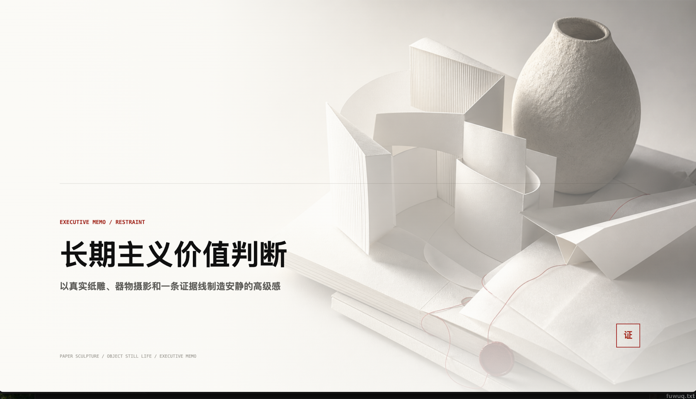
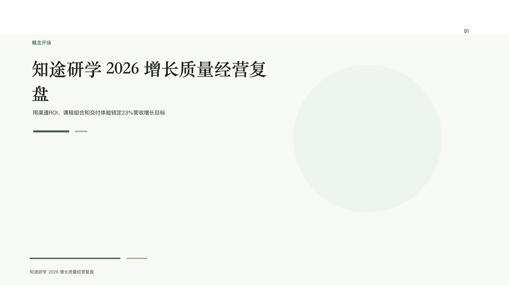
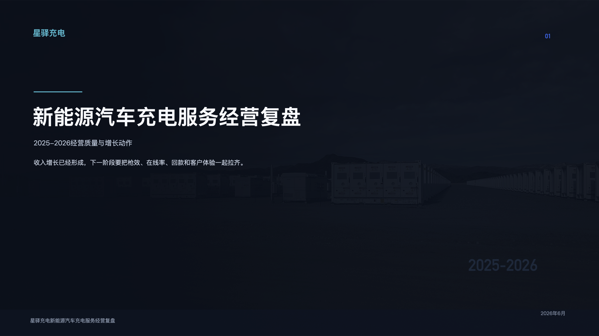
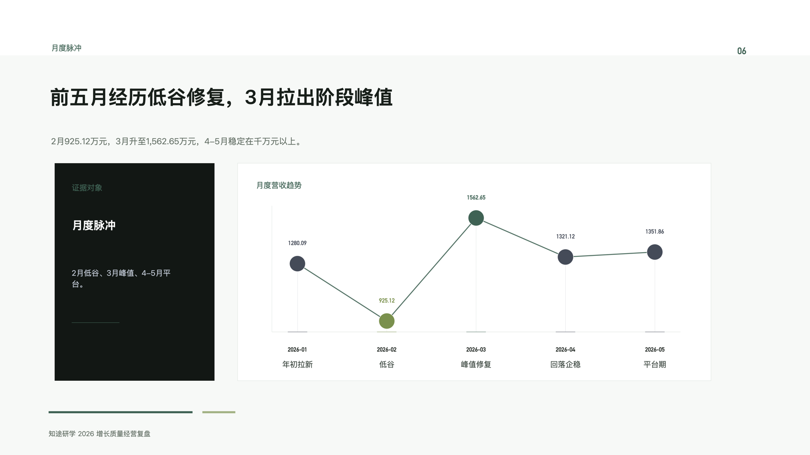
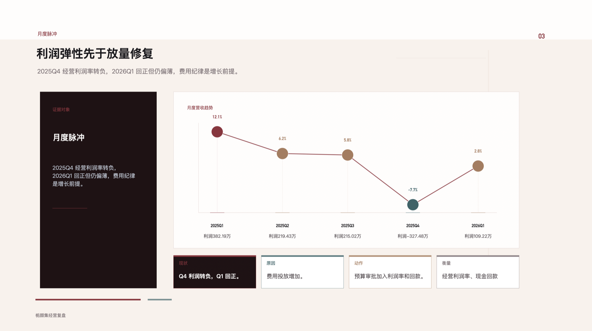
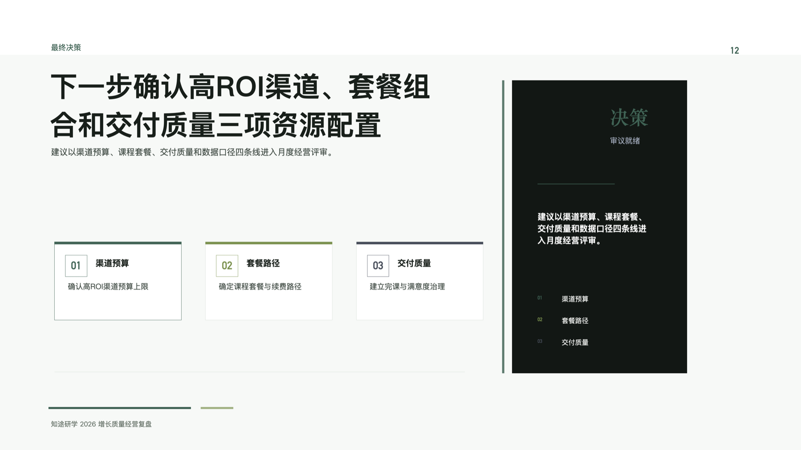

# Enterprise PPT Skill for Codex

面向中文商业场景的高质量 PPT 生成 skill。它把用户材料、会议纪要、行业数据、产品文案或简短需求，转成一套结构清晰、视觉克制、可编辑、可验证的商业 PPTX。

这个项目可以作为 Node.js 脚本链路运行，但更推荐在 Codex 里使用：Codex 能读取本地材料、按 skill 规则推进澄清、执行素材决策、调用生成脚本、检查预览图，再根据反馈持续修版。需要主视觉但材料没有合适图片时，skill 也支持在用户选择后生成图片并绑定到 PPT 版面中。

## 效果预览

以下示例来自当前项目生成结果，包含有图封面、无图结构封面、行业化暗色封面和数据/决策页。

<table>
  <tr>
    <td width="50%">
      
      <br>
      <sub>Executive memo / 纸雕静物主视觉</sub>
    </td>
    <td width="50%">
      
      <br>
      <sub>美妆个护品牌经营复盘 / 产品场景主视觉</sub>
    </td>
  </tr>
  <tr>
    <td width="50%">
      
      <br>
      <sub>在线教育经营复盘 / 无图结构封面</sub>
    </td>
    <td width="50%">
      
      <br>
      <sub>新能源汽车充电服务 / 行业化暗色封面</sub>
    </td>
  </tr>
  <tr>
    <td width="50%">
      
      <br>
      <sub>月度趋势页 / 证据卡片 + 折线数据</sub>
    </td>
    <td width="50%">
      
      <br>
      <sub>利润趋势页 / 图表 + 诊断卡片</sub>
    </td>
  </tr>
  <tr>
    <td colspan="2">
      
      <br>
      <sub>最终决策页 / 行动卡片 + 决策摘要</sub>
    </td>
  </tr>
</table>

## 为什么适合 Codex

- **材料在本地，链路也在本地**：Codex 可以直接读取用户提供的资料目录，执行 `material_ingest`、生成模型提示词、接收抽取结果，并把输出落到同一个工作区。
- **缺口不再静默跳过**：图片、品牌资产、证据字段或关键指标缺失时，链路会进入决策节点，由用户选择补充素材、生成图片、改用结构页或调整表达。
- **生成和修版闭环更短**：Codex 可以一边生成 PPTX，一边导出预览、检查布局问题、修复 renderer，再跑回归测试。
- **适合商业交付**：每页围绕一个 claim 和一个 proof object 组织，优先使用真实材料、数据图表、流程图、矩阵、证据卡片和行业化版面。

## 快速开始

```bash
npm install
npm test
npm run sample
```

从已有 deck plan 生成 PPTX：

```bash
node scripts/generate_pptx.js examples/sample-deck-plan.json out/sample.pptx
```

验证 PPTX 结构和文本：

```bash
node scripts/validate_pptx.js out/sample.pptx --expect-slides 10 --require 新能源,告警
```

导出预览并做视觉 QA：

```bash
node scripts/validate_pptx.js out/sample.pptx --expect-slides 10 --preview-dir out/preview
node scripts/visual_qa.js out/sample.pptx --preview-dir out/preview --plan examples/sample-deck-plan.json
```

## 材料到 PPT 的链路

真实材料默认走分阶段链路：

```text
raw materials
  -> scripts/material_ingest.js
  -> scripts/material_orchestration_prompt.js
  -> source audit / story architecture / clarification / extraction / critic
  -> scripts/material_to_deck_plan.js
  -> scripts/deck_asset_decision_gate.js
  -> scripts/resolve_visual_assets.js
  -> scripts/generate_pptx.js
  -> scripts/validate_pptx.js
  -> scripts/visual_qa.js
```

一键交付入口：

```bash
npm run materials:deliver -- <materials...> --out-dir out/delivery-run --model-json out/material-extraction.json --quality-mode formal
```

没有 `material-extraction.json` 时，交付链路会停在模型抽取 prompt 节点，等待外部模型结果或人工审阅后继续。小型低风险材料可加 `--auto-draft` 生成内部草案。

## 图片与资产策略

- 有真实品牌、产品、场景或数据素材时，优先绑定用户材料。
- 当版面需要主视觉而材料没有合适图片时，Codex 会引导用户选择补充图片、生成图片或改用无图结构页。
- 生成图片用于提升版面表达和行业语境，不会把测试说明、占位词、链路解释写进 PPT 页面。
- renderer 只消费已经绑定的 `imagePath` 或结构化视觉配置；素材决策发生在生成 PPTX 之前。

## 设计契约

- 每页一个明确 claim。
- 每页一个 proof object：图解、矩阵、流程、证据图、数据视图、风险板、对比结构或价值信号。
- 中文 PPT 的非必要可见微文案默认中文；品牌名、产品名、URL、邮箱、股票代码和标准缩写可保留原文。
- 图片必须承担证据、产品、场景、人物、地点或情绪主视觉职责，不作为随机装饰。
- 不把测试、占位、验收、内部链路或“待补充”文案写入面向用户的页面。

## 常用命令

材料链路：

```bash
npm run materials:ingest -- <materials...> --out out/material-bundle.json
npm run materials:orchestrate -- --bundle out/material-bundle.json --out-dir out/model-orchestration
npm run materials:plan -- --bundle out/material-bundle.json --model-json out/material-extraction.json --out out/deck-plan.json
npm run materials:deliver -- <materials...> --out-dir out/delivery-run --model-json out/material-extraction.json --quality-mode formal
```

资产链路：

```bash
npm run assets:gate -- out/deck-plan.json --out out/asset-gate.json
npm run assets:plan -- out/deck-plan.json --out out/asset-prompts.json
node scripts/deck_asset_decision_gate.js out/deck-plan.json --out out/asset-decision.json
node scripts/resolve_visual_assets.js out/deck-plan.json --decisions out/asset-decision.json --out out/deck-plan.assets.json
```

验证和回归：

```bash
npm run validate -- out/sample.pptx --expect-slides 10 --require 新能源,告警
npm run visual:qa -- out/sample.pptx --preview-dir out/preview --plan examples/sample-deck-plan.json
npm run test:fast
npm run verify:delivery -- --skip-preview
node scripts/run_all_tests.js --changed-files README.md --explain
```

## 项目结构

```text
.
├── SKILL.md                         # skill 入口和核心契约
├── CONTEXT.md                       # 新窗口轻量上下文
├── scripts/
│   ├── material_ingest.js           # 摄取用户材料
│   ├── material_orchestration_prompt.js
│   ├── material_to_deck_plan.js
│   ├── deck_asset_decision_gate.js  # 图片/素材决策门禁
│   ├── resolve_visual_assets.js     # 绑定真实素材或生成图片结果
│   ├── generate_pptx.js             # 生成可编辑 PPTX
│   ├── validate_pptx.js             # PPTX 结构和文本验证
│   └── visual_qa.js                 # 预览图和视觉 QA
├── assets/                          # 视觉系统、copy policy、媒体资产
├── docs/readme/                     # README 展示图
├── examples/                        # deck plan、材料抽取和验收样例
├── references/                      # 架构、QA、release notes
└── templates/                       # prompt 片段
```

## Agent 入口

新窗口继续优化本项目时，先读 [CONTEXT.md](CONTEXT.md)，再按任务读取对应 reference。普通检索会通过 [.rgignore](.rgignore) 避开大型输出、recipe 分片和生成目录。

## 许可证

MIT
